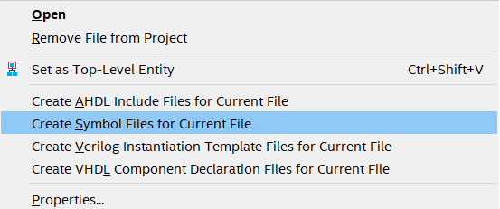
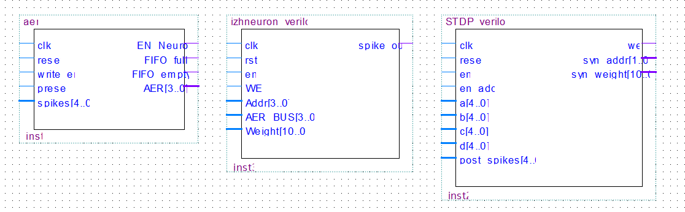

# neuromorphic_engineering

This software has been written for the project _Towards implementing a spiking neural network on the Arduino MKR Vidor 4000_. The project consists out of three components, based on [1]: 

1. An implementation of a Izhikevich neuron, as described in [2].
2. A block that implements the spike-timing-dependent plasticity (STDP) learning rule for spiking neurons.
3. An Address Event Representation (AER) system, that can be used to connect different neurons to a network.

To allow the software to run on a Field-programmable gate array (FPGA) chip, it has been written in Verilog (HDL), using the _Intel Quartus Prime Lite_ ([20.1.1](https://fpgasoftware.intel.com/20.1.1/?edition=lite&platform=windows)) IDE. The software is open source and we encourage using it for anything you like. The software has been tested, and the performance has been verified on an Arduino MKR Vidor 4000. Yet, we do not feel responsible for any damage that might occur to your devices when using (an altered version of) the software.

## Using the software

The verilog implementations of the components can found in the folders `Verilog_projects/*`. One can open each project in Quartus by clicking the `*.qpf` files. The main modules, `Verilog_projects/AER/AER.v`, `Verilog_projects/stdp/STDP_verilog.v` and `Verilog_projects/neuron/izhneuron_verilog.v` include testbenches that can be simulated using _Altera Modelsim_ to verify the behaviour of the components by inspecting their simulated waveforms. Furthermore, you can add the components to your own project by copying all verilog files of the respective verilog project to your own project. Symbol files of the components can be created by right-clicking the component in the project navigator of Quartus, and selecting _Create Symbol Files for Current File_:

Then, the generated symbol files can be incorporated in your own block design file by dragging and dropping them:

All components have a `reset` (sometimes abbreviated with `rst`) input. To ensure the correct behaviour of the components, these inputs should be high for at least one clock cycle before using the component. The other inputs and outputs of the components are discussed in length in our report. An example architecture of a spiking neural network using these components can be found in [1]. 

### JTAG_Interface

If one wants to upload the software to the Arduino MKR Vidor 4000, we encourage you to use the [_JTAG_Interface_ by HerrNamenlos123](https://github.com/HerrNamenlos123/JTAG_Interface) for setting up the communication between the CPU and the FPGA. Examples of connecting each component to the interface can be found in the `Arduino_libraries` folder (`Arduino_libraries/*/MyDesign.bdf`), together with their bitflipped output files, `Arduino_libraries/*/FPGA_Bitstream.h`, and arduino code, `Arduino_libraries/*/*_FPGA_Tester.ino`. We refer to the project by HerrNamenlos123 for the instructions for linking the compiled Quartus projects to the arduino code. 

## Documentation & Questions

Elaborate documentation of the components is incorporated in the report. If you would like to have it, or if you have any other questions or remarks, do not hesitate to contact me (`chiara.thoeni@ru.nl`). 

## References
[1]  E.-G. M. Mallorqu ́ı, ‘Digital system for spiking neural network emulation,’ Polytechnic Universityof Catalonia, Barcelona, Spain, Tech. Rep., Jun. 2017. 
[2] E. M. Izhikevich, ‘Simple model of spiking neurons,’ _IEEE Transactions on neural networks_, vol. 14,no. 6, pp. 1569–1572, 2003.

